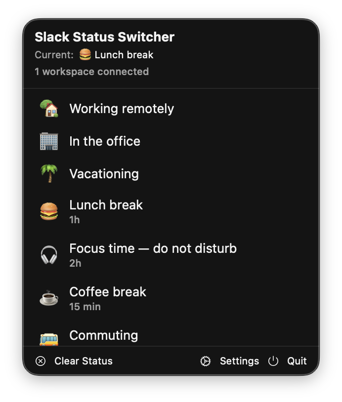
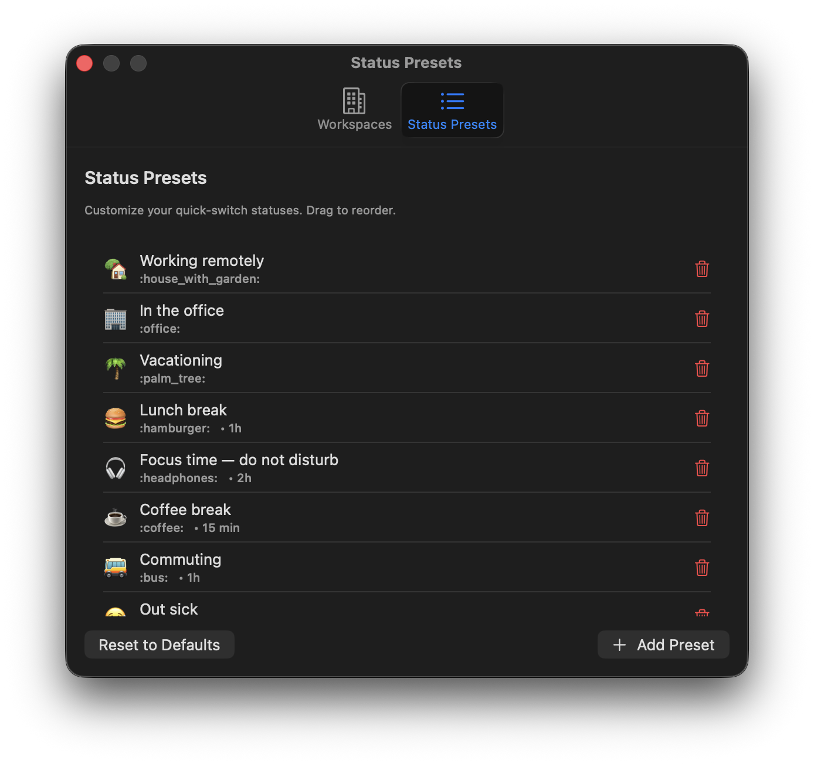
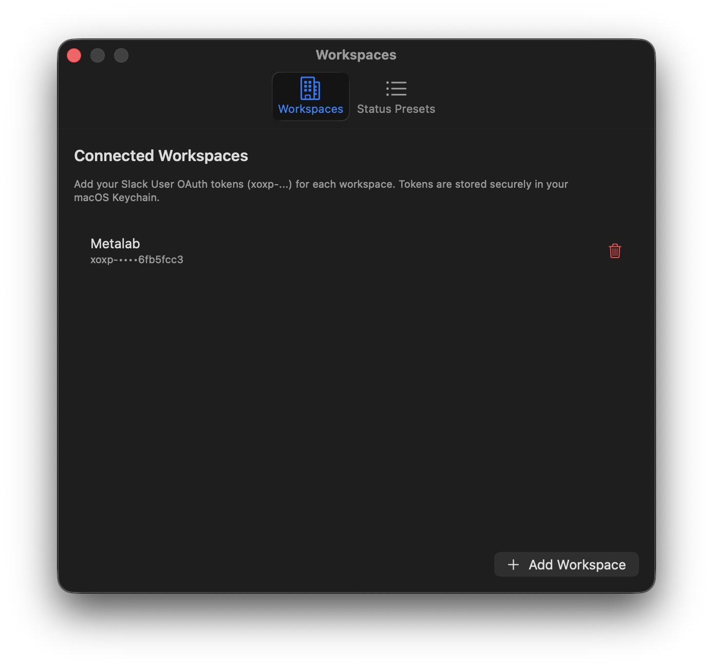

# Slack Status Switcher

A lightweight macOS menu bar app to quickly set your Slack status across multiple workspaces with a single click.

| Main Menu | Status Presets | Workspaces Config |
|:-:|:-:|:-:|
|  |  |  |

## Features

- **Menu bar app** — lives in your menu bar, no dock icon
- **Multiple workspaces** — update your status across all connected Slack workspaces at once
- **Customizable presets** — comes with 10 default statuses, fully customizable
- **Auto-expiring statuses** — set statuses that automatically clear after a set time
- **Secure token storage** — workspace tokens are stored in your macOS Keychain
- **Native macOS** — built with SwiftUI, no Electron, no web views

## Requirements

- macOS 15.0+
- Xcode 26+ (to build from source)

## Slack App Setup

You'll need a Slack User OAuth Token for each workspace. Repeat these steps per workspace:

1. Go to [api.slack.com/apps](https://api.slack.com/apps) and click **Create New App** → **From Scratch**
2. Name it (e.g. "Status Switcher") and select your workspace
3. Go to **OAuth & Permissions** → scroll to **User Token Scopes** → add:
   - `users.profile:read`
   - `users.profile:write`
4. Scroll back up and click **Install to Workspace** → Authorize
5. Copy the **User OAuth Token** (starts with `xoxp-...`)
6. Paste it in the app's **Settings → Add Workspace**

## Build & Run

```bash
git clone https://github.com/YOUR_USERNAME/SlackStatusSwitcher.git
cd SlackStatusSwitcher
open SlackStatusSwitcher.xcodeproj
```

Then press **⌘R** in Xcode to build and run. The app will appear in your menu bar.

## Usage

- Click the menu bar icon to see your status presets
- Click any preset to apply it across all connected workspaces
- Click **Clear Status** to remove your status
- Open **Settings** to manage workspaces and customize presets

## License

MIT
